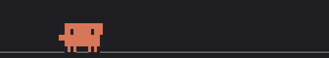

# clawd

A mod for [Claude Code](https://code.claude.com): Clawd, the small creature from the
Claude Code banner, runs around in a strip above your prompt and reacts to the session.



There is also a version in which Clawd is the MatSci octopus:
[AutomatedAlchemy/clawd-matsci](https://github.com/AutomatedAlchemy/clawd-matsci).

- It hops when you send a prompt.
- It holds up a scroll while Claude only reads, and stacks a brick for every other tool
  call. The next prompt kicks the pile over.
- It trips when a tool call fails and celebrates when a turn ends.
- Each subagent gets a small Clawd of its own, which runs off when the subagent is done.
- Between events it wanders, jumps and chases sparks. After 3 idle minutes it falls asleep.

This is a fan project. Anthropic did not make it and does not endorse it.

## Install

```bash
claude plugin marketplace add Probst1nator/clawd
claude plugin install clawd@clawd
```

Start a new session. `/clawd help` explains the rest. `/clawd off` hides Clawd (it
stays hidden in later sessions until `/clawd on`), and
`claude plugin disable clawd@clawd` turns the mod off.

Tested with Claude Code 2.1.292. The mod uses plugin hooks that draw into the terminal,
so older versions may not load it.

## Commands

| Command | What it does |
|---|---|
| `/clawd` | what Clawd is doing now |
| `/clawd help` | every command; `help uml` draws how Clawd behaves |
| `/clawd jump 3` | play an act now, up to 5 times in a row |
| `/clawd a1 wave` | a subagent's small Clawd plays an act |
| `/clawd list acts` | the acts; also `made`, `emotes`, `skins`, `minis` |
| `/clawd emote <emote>` | for a while, Clawd turns into an emote's look or holds its thing |
| `/clawd emote create`, `change`, `delete`, `preview` | make, redraw, remove or picture an emote |
| `/clawd skin <skin>`, `none`, `auto` | the body Clawd wears all the time, for this session |
| `/clawd skin create`, `change`, `delete`, `preview` | make, redraw, remove or picture a skin |
| `/clawd on`, `/clawd off` | show or hide Clawd |
| `/clawd autopick` | switch a model choosing what Clawd plays on or off (see below); `now` chooses once; `haiku`, `sonnet` or `opus` sets the model |
| `/clawd debug` | switch showing each autopick's whole reply in the transcript on or off |
| `/clawd trace` | switch writing each autopick to a file on or off |

While you type `/clawd `, a list above the prompt shows what fits, and a space writes out
a word that fits one name.

## Model calls

By default the mod makes no model calls. Clawd picks random acts by itself.

`/clawd autopick` hands that choice to a model (Haiku). It reads what happens in the
session and picks what Clawd and the small Clawds play: after each prompt and turn, and
every 10 to 60 seconds. In a busy session that is about 100 calls an hour of about 1,500
tokens each, and it may have Opus write up to 5 new acts or looks a day. All of it runs
through your own Claude Code login and counts against your usage. `/clawd autopick`
again stops it. `/clawd autopick sonnet` or `opus` has that model pick instead, at a
higher cost per pick, and `/clawd autopick haiku` goes back. Both settings are remembered.

While Remote Control is on, Clawd wears an antenna and the autopicker pauses, so Clawd
plays random acts. When Remote Control ends, the autopicker goes on as it was set.

`/clawd emote create <name> <what it looks like>` has Opus draw a new emote: a look Clawd
turns into for a while, or a thing it holds or sets down beside it while it keeps its body.
`/clawd skin create <name> <what it looks like>` draws a skin, a body Clawd wears all the
time. `/clawd emote change` and `/clawd skin change` redraw one. Each runs only when you
type it.

## Where it keeps things

New acts, emotes, skins, their preview images and the autopick traces (`/clawd trace`) go to
`~/.claude/clawd/`, or `$CLAUDE_CONFIG_DIR/clawd/` when that is set. A plugin update
leaves that folder alone. Writing preview images needs `python3` on the PATH.

## Development

`plugin/` is the mod: `hooks/register.tsx` holds the hooks, `hooks/clawd-sim.ts` the
world, the animation and the drawing. Check it with `claude plugin validate plugin` and
`claude plugin test plugin`.

This repository gets release snapshots from a private working copy. Issues are welcome.

## License

MIT, see [LICENSE](LICENSE).
